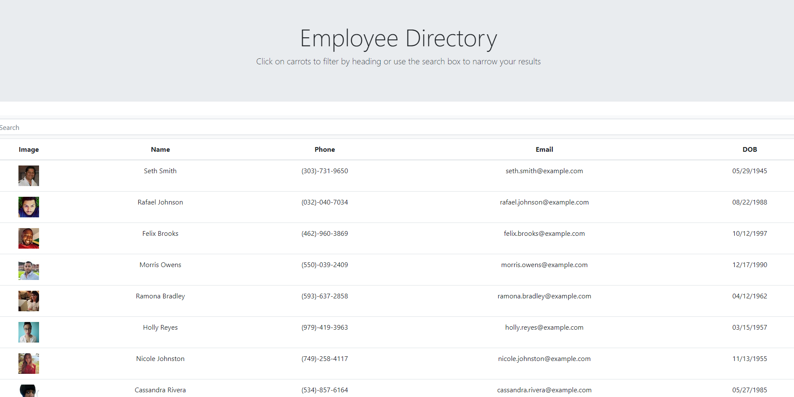

# EmployeeDirectory  

  ## Link to deployed application
  https://tiroxxx.github.io/EmployeeDirectory/
  
  ## Description 
  In this application the user will be shown 200 randomly generated employees, from which they can search for one by name. Also by clicking on the word Name the list will be sorted by first name
  ## Table of Contents
  
  * [Installation](#installation)
  * [Usage](#usage)
  * [Credits](#credits)
  * [License](#license)
  * [Tests](#tests)
  * [Questions](#questions)
  
  ## Installation
  Run this to install
  <pre><code>npm i</code></pre>
  
  ## Usage
  after installing all dependencies run this command in the terminal: npm start

  ## Credits
  Contributors: Christian Marquez
  
  ## License
  This program is licensed under <code>MIT License</code>
  
  ## Contributing
  After forking this repository, contributions in the form of issues and pull requests are welcomed and encouraged.

  ## Tests
  To test this application, run the following command
  <pre><code></code></pre>

  ## Questions
  If there are any questions about this application,  
  please contact me through email at christianmarquez41@gmail.com   
  Github : https://github.com/tiroxxx
  
